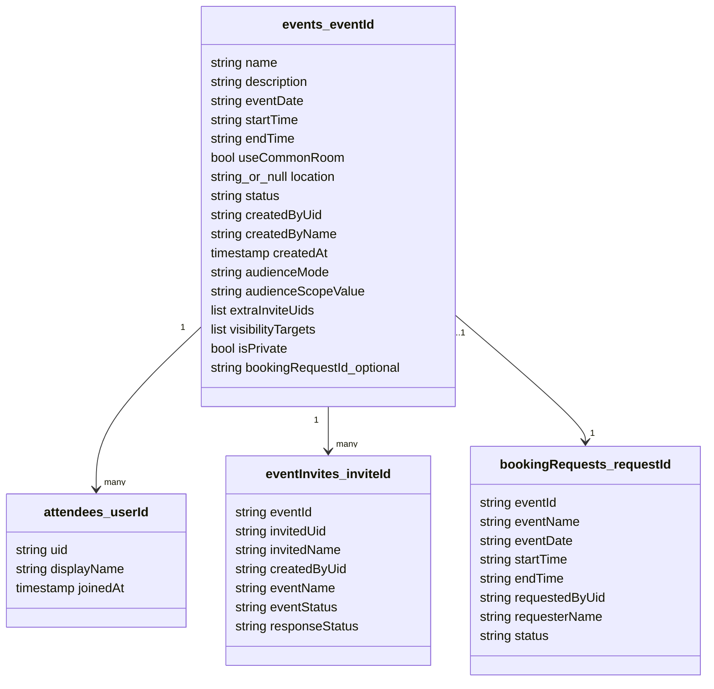
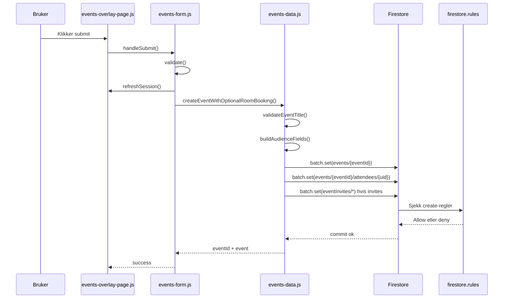
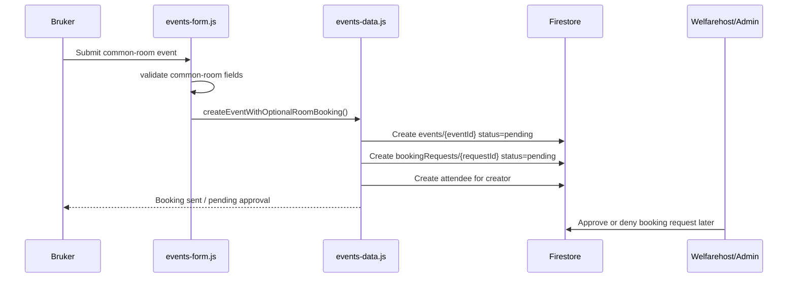
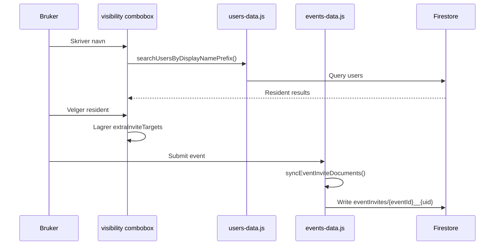
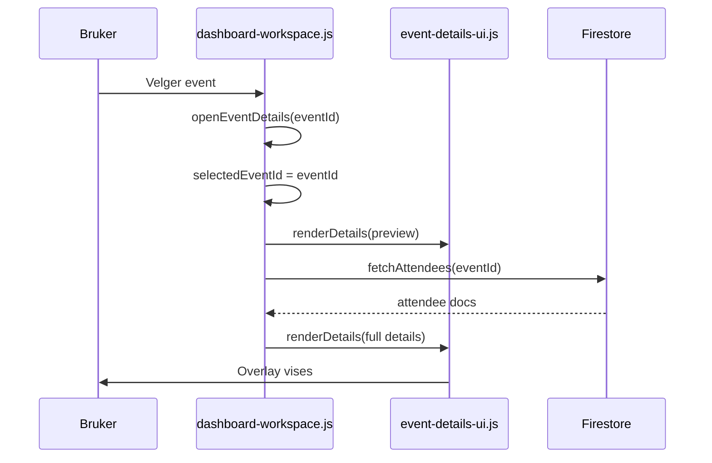
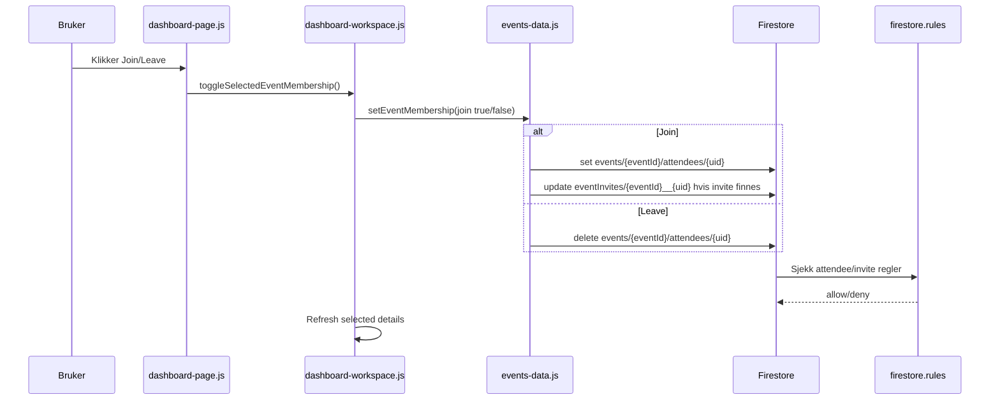
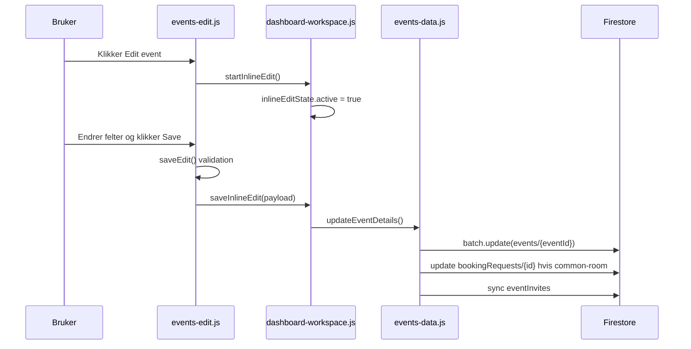
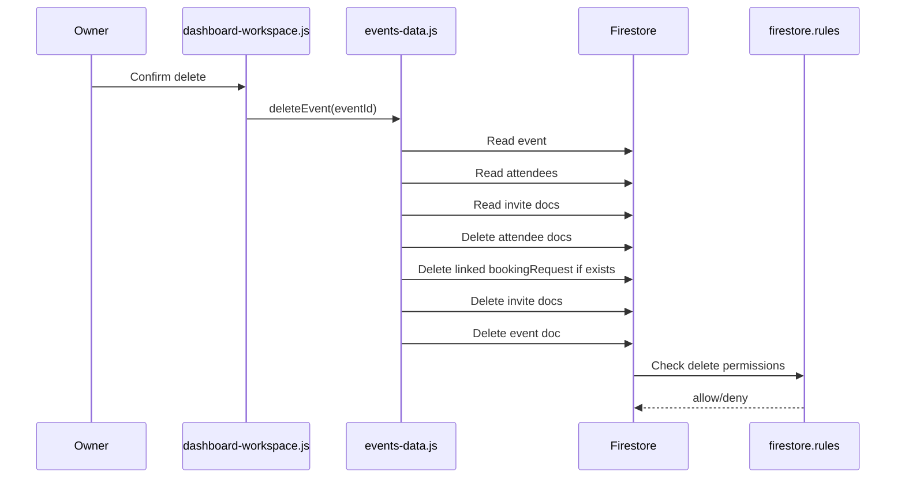
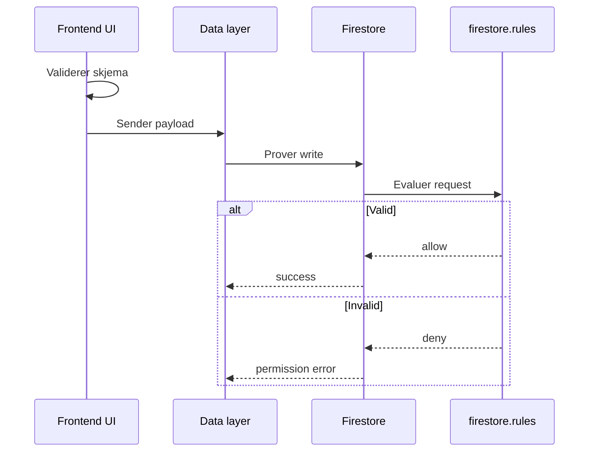
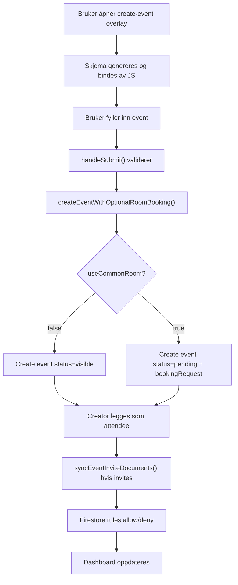

# Event lifecycle oral exam guide

Dette dokumentet forklarer event-systemet i Connect fra brukerens perspektiv først, og deretter hva som skjer i HTML, JavaScript, Firestore og `firestore.rules`.

Fokus: opprette event, vanlig event, common-room booking, visibility, invites, event details, join/leave, edit, cancel, delete og sikkerhetsregler.

Ikke fokus: kalenderlogikken i seg selv. Kalender nevnes bare der den trigger create-event eller event-details.

## Mental modell

Event-systemet er delt i lag:

- `public/menu2.html`: har statiske overlay-skall og tomme mount-punkter.
- `public/scripts/ui-parts/*`: bygger eller renderer DOM/UI.
- `public/scripts/pages/*`: kobler DOM til funksjoner, for eksempel click handlers.
- `public/scripts/features/*`: styrer feature-logikk, validering og state.
- `public/scripts/data/*`: leser og skriver Firestore.
- `firestore.rules`: bestemmer hva som faktisk er lov i databasen.

Kort sagt:

> HTML gir plass til UI-et, JavaScript fyller og styrer UI-et, `events-data.js` skriver data, og `firestore.rules` er siste sikkerhetssjekk.

## Dataformene du må kunne



Viktig:

- `events/{eventId}` er hoveddokumentet.
- `events/{eventId}/attendees/{userId}` viser hvem som har joinet.
- `eventInvites/{eventId}__{invitedUid}` er egne invite-dokumenter.
- `bookingRequests/{requestId}` finnes bare for common-room events.

## Kapittel 1: Hvordan create-event overlay åpnes

### Hva brukeren ser

Brukeren er på dashboardet og gjør en handling som betyr "lag event". I denne appen skjer det typisk fra event-/dashboard-flater. Brukeren ser et overlay/popup med tittelen "Create Event".

### Hva HTML allerede har

I `public/menu2.html` ligger selve overlay-skallet allerede i HTML:

```html
<div id="create-event-overlay" class="events-overlay events-overlay-shell" hidden>
```

Det betyr:

- overlayet finnes allerede på siden
- det er bare skjult med `hidden`
- det er ikke en ny side
- det er ikke routing
- det er ikke Firebase som åpner popupen

HTML har også:

```html
<section id="create-event-form-mount" class="events-overlay-card event-details-card"></section>
```

Dette er et tomt mount-punkt. Selve create-event skjemaet blir generert av JavaScript.

### Hva JavaScript binder eller genererer

`event-form-ui.js` lager selve skjema-markupen og plasserer det inn i `#create-event-form-mount`.

`events-overlay-page.js` lager `eventsOverlayApi`, som inneholder funksjoner som:

- `openSidebar`
- `closeSidebar`
- `resetForm`
- `pickDate`
- `handleSubmit`
- `setPlace`
- `setAudienceMode`

`dashboard-page.js` kobler dashboardet til denne API-en.

### Steg-for-steg call chain

Når dashboardet skal apne create-event overlayet:

1. `dashboard-page.js` kaller `openCreateEventForDate(dateIso)`.
2. Den sjekker at datoen ikke er i fortiden.
3. Den sjekker at `embeddedEvents2Api` finnes.
4. Den refresher session med `embeddedEvents2Api.refreshSession(...)`.
5. Den refresher opptatte common-room datoer med `refreshBusyDates()`.
6. Den kaller `embeddedEvents2Api.resetForm()`.
7. Den kaller `embeddedEvents2Api.openSidebar(...)`.
8. `openSidebar()` i `events-core.js` fjerner `hidden` fra `#create-event-overlay`.

Selve funksjonen som faktisk viser overlayet er:

```js
function openSidebar(onOpened) {
  g('create-event-overlay').removeAttribute('hidden');
}
```

### Hva som skrives/leses i Firestore

Bare det a apne overlayet skriver ikke event-data.

Men for å vise riktig common-room availability, kan appen lese godkjente bookingdatoer:

- `bookingRequests` der `status == "approved"`
- eller synlige common-room events som fallback

### Hvilke regler beskytter dette

Åpning av overlayet er bare UI, sa Firestore rules er ikke hoveddelen her. Rules blir viktige når brukeren faktisk trykker submit og appen prøver å skrive eventet.

### Kort muntlig eksamenssvar

> Create-event overlayet er bade HTML og JavaScript. HTML har et skjult overlay-skall med `id="create-event-overlay"`, men JavaScript genererer skjemaet, binder knappene og åpner overlayet. Den konkrete apningen skjer i `openSidebar()`, som fjerner `hidden` fra overlayet.

### Sjekk deg selv

- Er create-event overlayet en egen HTML-side?
- Hvilket element skjules/vises?
- Hvilken funksjon fjerner `hidden`?
- Hvorfor sier vi at det er bade HTML og JavaScript?

## Kapittel 2: Hvordan create-event skjemaet er bygget og bindes

### Hva brukeren ser

Brukeren ser felter for:

- event title
- description
- common room eller custom location
- dato
- starttid og sluttid
- visibility: anyone, area, block, floor, invite only
- invite-search når visibility trenger invitees
- common-room terms checkbox
- submit-knapp

### Hva HTML allerede har

`menu2.html` har bare mount-punktet:

```html
<section id="create-event-form-mount"></section>
```

Det betyr at skjemaet ikke ligger ferdig skrevet i `menu2.html`.

### Hva JavaScript binder eller genererer

`event-form-ui.js` bygger form-markup. For create-mode bygger den blant annet:

- `#ev-name`
- `#ev-desc`
- `#card-loc`
- `#card-cr`
- `#visibility-select`
- `#visibility-search`
- `#date-row`
- `#tp-from`
- `#tp-to`
- `#ev-terms`
- `#btn-submit`
- `#feedback`

`events-overlay-page.js` binder interaksjonene:

- `#card-loc` click -> `eventsOverlayApi.setPlace('loc')`
- `#card-cr` click -> `eventsOverlayApi.setPlace('cr')`
- `#visibility-select` change -> `eventsOverlayApi.setAudienceMode(...)`
- `#date-row` click -> `eventsOverlayApi.toggleCalendar()`
- `#tp-from` click -> `eventsOverlayApi.openTimePicker('from')`
- `#tp-to` click -> `eventsOverlayApi.openTimePicker('to')`
- `#btn-submit` click -> `eventsOverlayApi.handleSubmit()`
- `#close-sidebar-btn` click -> `eventsOverlayApi.closeSidebar()`

### Steg-for-steg call chain

1. `menu2.html` laster scriptfilene i riktig rekkefolge.
2. `event-form-ui.js` eksponerer UI-hjelpere på `window.connectUi.eventForm`.
3. `events-core.js` lager shared runtime state for overlayet.
4. `events-form.js` lager submit-controlleren.
5. `events-overlay-page.js` lager `window.connectPages.events2`.
6. `dashboard-page.js` kaller `bindEvents2Interactions(...)`.
7. Da bindes DOM-elementene til funksjonene.

### Hva som skrives/leses i Firestore

Dette kapitlet handler mest om UI. Firestore brukes for:

- session/profile refresh
- busy common-room dates
- resident search for invites

Selve eventet skrives først når `handleSubmit()` lykkes.

### Hvilke regler beskytter dette

Firestore rules beskytter ikke UI-bindinger. Men selv om UI-en tillater submit, må Firestore rules fortsatt godkjenne event-dokumentet.

### Kort muntlig eksamenssvar

> Skjemaet er ikke bare hardkodet i HTML. HTML har et tomt mount-punkt, mens `event-form-ui.js` bygger skjemaet. Etterpa binder `events-overlay-page.js` knappene og inputfeltene til funksjoner som `setPlace`, `setAudienceMode` og `handleSubmit`.

### Sjekk deg selv

- Hvorfor finnes `#create-event-form-mount`?
- Hvilken knapp trigger submit?
- Hvor bindes submit-knappen?
- Hva er forskjellen på `event-form-ui.js` og `events-overlay-page.js`?

## Kapittel 3: Normal event creation flow

### Hva brukeren ser

Brukeren velger custom location, fyller ut skjemaet, velger visibility, og trykker submit. Hvis alt er gyldig, far brukeren success-melding om at eventet er opprettet.

### Hva HTML allerede har

HTML har overlay-skallet og mount-punktet. Feltene er generert av JS.

### Hva JavaScript binder eller genererer

Submit-knappen `#btn-submit` er bundet i `events-overlay-page.js`:

```js
g('btn-submit')?.addEventListener('click', async () => {
  const submitResult = await eventsOverlayApi.handleSubmit();
});
```

`handleSubmit()` kommer fra `events-form.js`.

### Steg-for-steg call chain



### Hva som skrives/leses i Firestore

For normal event skrives:

`events/{eventId}`:

```js
{
  name,
  description,
  eventDate,
  startTime,
  endTime,
  useCommonRoom: false,
  location,
  isPrivate,
  audienceMode,
  audienceScopeValue,
  extraInviteUids,
  visibilityTargets,
  status: 'visible',
  createdByUid,
  createdByName,
  createdAt
}
```

Og creator blir automatisk attendee:

`events/{eventId}/attendees/{creatorUid}`:

```js
{
  uid: creatorUid,
  displayName: creatorName,
  joinedAt
}
```

Hvis eventet har invitees, skrives også:

`eventInvites/{eventId}__{invitedUid}`.

### Hvilke regler beskytter dette

`firestore.rules` krever blant annet:

- bruker er signert inn
- email matcher `@ssn.no`
- eventet har bare tillatte felt
- `createdByUid == request.auth.uid`
- `createdAt` er timestamp
- `useCommonRoom` er boolean
- event title er gyldig
- `status` er riktig
- audience-feltene er gyldige

For normal event krever reglene:

- `useCommonRoom == false`
- `status == 'visible'`
- ingen `bookingRequestId`

### Kort muntlig eksamenssvar

> Når en vanlig event opprettes, validerer frontend skjemaet og kaller `createEventWithOptionalRoomBooking()`. Siden det ikke er common room, opprettes ett event-dokument med `status: "visible"`. Creator legges automatisk inn som attendee, og eventuelle invite-dokumenter synkes. Firestore rules sjekker at eventet har riktig form og at brukeren har lov til å opprette det.

### Sjekk deg selv

- Hvilken funksjon skriver eventet?
- Hvorfor blir creator attendee automatisk?
- Hva er status for et normalt event?
- Hvorfor skal normal event ikke ha `bookingRequestId`?

## Kapittel 4: Common-room booking event flow

### Hva brukeren ser

Brukeren velger common room, fyller ut skjemaet, aksepterer terms, og sender inn. Brukeren far beskjed om at booking er sendt og venter på approval fra welfarehost.

### Hva HTML allerede har

Common-room terms og submit UI genereres av `event-form-ui.js`, ikke direkte i `menu2.html`.

### Hva JavaScript binder eller genererer

Når `state.place === 'cr'`, regnes eventet som common-room event.

`events-form.js` sjekker:

- common-room dato ikke er opptatt
- terms checkbox er checked
- date/time er gyldig

### Steg-for-steg call chain



### Hva som skrives/leses i Firestore

For common-room event skrives to koblede dokumenter.

`events/{eventId}`:

```js
{
  useCommonRoom: true,
  location: 'Common Room',
  status: 'pending',
  bookingRequestId,
  ...
}
```

`bookingRequests/{requestId}`:

```js
{
  eventId,
  eventName,
  eventDate,
  startTime,
  endTime,
  isPrivate,
  requestedByUid,
  requesterName,
  status: 'pending',
  createdAt
}
```

Creator legges også inn som attendee, men eventet er fortsatt `pending`.

### Hvilke regler beskytter dette

For common-room event creation krever `firestore.rules`:

- `useCommonRoom == true`
- `status == 'pending'`
- `bookingRequestId` finnes og er string

Booking request-regelen krever:

- signed-in resident
- `requestedByUid == request.auth.uid`
- `status == 'pending'`

### Kort muntlig eksamenssvar

> Common-room events opprettes ikke som synlige med en gang. Appen lager et event med `status: "pending"` og et koblet `bookingRequests`-dokument med samme pending-status. Welfarehost eller admin må senere godkjenne eller avslå, og da oppdateres booking request og event sammen.

### Sjekk deg selv

- Hvorfor trenger common-room event et booking request?
- Hva er status for eventet for approval?
- Hvilket felt linker eventet til booking request?
- Hvorfor er terms checkbox relevant?

## Kapittel 5: Visibility / audience

### Hva brukeren ser

Brukeren velger hvem som kan se eller joine eventet:

- Anyone
- My housing area
- My housing block
- My floor
- Invite only

Hvis brukeren velger noe annet enn Anyone, kan brukeren også invitere ekstra residents.

### Hva HTML allerede har

Visibility-select og invite-search genereres av `event-form-ui.js`.

### Hva JavaScript binder eller genererer

`#visibility-select` er bundet i `events-overlay-page.js`.

Når verdien endres:

- `eventsOverlayApi.setAudienceMode(nextAudienceMode)` kalles
- hvis mode er `anyone`, fjernes invite targets
- hvis mode ikke er `anyone`, fokuseres invite-search

### Steg-for-steg call chain

1. Brukeren velger visibility i dropdown.
2. `events-overlay-page.js` oppdaterer `state.audienceMode`.
3. Invite combobox lar brukeren søke etter residents.
4. Valgte residents lagres i `state.extraInviteTargets`.
5. Ved submit sender `events-form.js` dette videre til `events-data.js`.
6. `events-data.js` kaller `buildAudienceFields(...)`.
7. `buildAudienceFields()` lager de faktiske Firestore-feltene.

### Hva som skrives/leses i Firestore

Audience blir lagret som:

```js
{
  audienceMode,
  audienceScopeValue,
  extraInviteUids,
  visibilityTargets,
  isPrivate
}
```

Eksempel for block:

```js
{
  audienceMode: 'block',
  audienceScopeValue: 'Campus:Alfa',
  visibilityTargets: [
    {
      type: 'block',
      value: 'Campus:Alfa',
      housingArea: 'Campus',
      housingBlock: 'Alfa'
    }
  ],
  extraInviteUids: [],
  isPrivate: false
}
```

Invite-only uten invitees blir:

```js
{
  audienceMode: 'inviteOnly',
  extraInviteUids: [],
  visibilityTargets: [],
  isPrivate: true
}
```

Det betyr privat solo-event.

### Hvilke regler beskytter dette

`firestore.rules` har `isValidEventAudienceState(data)`.

Den sjekker at:

- alle audience-feltene finnes
- `audienceMode` er en lovlig verdi
- `extraInviteUids` er list
- `visibilityTargets` er list
- `isPrivate` matcher invite-only/ingen invitees
- area/block/floor matcher current user sin housing profile

### Kort muntlig eksamenssvar

> Visibility er ikke bare tekst i UI-et. Når brukeren velger audience, konverterer `buildAudienceFields()` valget til normaliserte Firestore-felt: `audienceMode`, `audienceScopeValue`, `extraInviteUids`, `visibilityTargets` og `isPrivate`. Firestore rules validerer at disse feltene matcher brukerens profil og den valgte audience-modusen.

### Sjekk deg selv

- Hva betyr `audienceScopeValue`?
- Hvorfor trengs bade `extraInviteUids` og `visibilityTargets`?
- Hva skjer hvis invite-only har null invitees?
- Hvorfor kan ikke frontend alene stole på visibility?

## Kapittel 6: Event invites og invite documents

### Hva brukeren ser

Brukeren kan søke etter residents og legge dem til som invitees. Inviterte brukere kan senere se invitasjonen og akseptere eventet.

### Hva HTML allerede har

HTML har ikke en fast liste med residents. Invite-search er en JS-generert combobox.

### Hva JavaScript binder eller genererer

`events-overlay-page.js` har `initVisibilityCombobox(...)`.

Viktig oppforsel:

- søker etter residents når brukeren skriver
- bruker `users-data.js` sin `searchUsersByDisplayNamePrefix(...)`
- bygger tags for valgte invitees
- lagrer valgte targets i state

### Steg-for-steg call chain



### Hva som skrives/leses i Firestore

Invites lagres i to former.

På eventet:

```js
extraInviteUids: ['uid1', 'uid2']
visibilityTargets: [
  { type: 'resident', value: 'uid1', label: 'Name' }
]
```

Som egne invite-dokumenter:

```js
eventInvites/{eventId}__{invitedUid}
```

med felter som:

```js
{
  eventId,
  invitedUid,
  invitedName,
  createdByUid,
  createdByName,
  eventName,
  eventDate,
  startTime,
  endTime,
  eventStatus,
  audienceMode,
  responseStatus: 'pending',
  createdAt,
  updatedAt,
  respondedAt: null
}
```

### Hvilke regler beskytter dette

`firestore.rules` krever at invite-dokumentet:

- har riktig id: `eventId + '__' + invitedUid`
- matcher linked event
- har invitee i eventets `extraInviteUids`
- ikke lar creator overskrive invitee sin response
- lar invitee bare endre response til `accepted`

### Kort muntlig eksamenssvar

> Invites lagres bade på event-dokumentet og som egne `eventInvites`-dokumenter. Eventet bruker `extraInviteUids` og `visibilityTargets` for access, mens `eventInvites` gjores for notifications og for å laste invitasjoner effektivt. `syncEventInviteDocuments()` holder disse dokumentene synkronisert med eventet.

### Sjekk deg selv

- Hvorfor holder det ikke bare med `extraInviteUids`?
- Hva er id-formatet for invite-dokumenter?
- Hvem kan akseptere en invite?
- Hva betyr `responseStatus`?

## Kapittel 7: Event details view

### Hva brukeren ser

Når brukeren åpner et event, ser de:

- tittel
- host
- dato/tid
- location
- visibility
- description
- participants
- join/leave button hvis aktuelt
- status badge
- owner-menu med edit/cancel/delete hvis brukeren eier eventet

### Hva HTML allerede har

`menu2.html` har et event-details overlay-skall:

```html
<div id="event-details-overlay" class="events-overlay" hidden>
  <div id="event-details-content-mount"></div>
</div>
```

Selve details-innholdet blir mountet av `event-details-ui.js`.

### Hva JavaScript binder eller genererer

`event-details-ui.js` bygger markup med blant annet:

- `#event-membership-button`
- `#event-details-menu-button`
- `#event-edit`
- `#event-cancel`
- `#event-delete`
- `#cancel-event-confirm`
- `#delete-event-confirm`

`dashboard-workspace.js` styrer hvilket event som er valgt.

### Steg-for-steg call chain



### Hva som skrives/leses i Firestore

Når details åpnes, leses attendees:

```text
events/{eventId}/attendees/*
```

Eventet selv er allerede i dashboard state fra event-loading/listeners.

### Hvilke regler beskytter dette

Attendee reads er bare lov hvis parent event er readable. Det betyr at brukeren må ha tilgang til eventet for å se participants.

### Kort muntlig eksamenssvar

> Event details er et overlay som har et statisk mount-punkt i HTML, men selve innholdet mountes av `event-details-ui.js`. Når et event åpnes, setter dashboard workspace `selectedEventId`, renderer en rask preview, henter attendees fra Firestore og renderer detaljene på nytt. Owner far edit/cancel/delete, andre brukere far join/leave hvis eventet tillater det.

### Sjekk deg selv

- Hvor kommer details-markupen fra?
- Hva er `selectedEventId`?
- Hvor hentes participants fra?
- Hvorfor ser ikke alle edit/delete?

## Kapittel 8: Joining og leaving events

### Hva brukeren ser

En bruker som ikke eier eventet kan trykke Join event. Etterpa endres knappen til leave-state, og brukeren blir participant. Hvis brukeren var invitert, blir inviten akseptert.

### Hva HTML allerede har

Join-knappen ligger i details-markupen som genereres av `event-details-ui.js`:

```html
<button id="event-membership-button">
```

### Hva JavaScript binder eller genererer

`dashboard-page.js` binder click på membership button til `toggleSelectedEventMembership()`.

`dashboard-workspace.js` har `toggleSelectedEventMembership(onChanged)`.

`events-data.js` har `setEventMembership(options)`.

### Steg-for-steg call chain



### Hva som skrives/leses i Firestore

Join skriver:

```js
events/{eventId}/attendees/{userUid}
```

med:

```js
{
  uid,
  displayName,
  joinedAt
}
```

Hvis brukeren hadde invite:

```js
eventInvites/{eventId}__{userUid}
```

oppdateres:

```js
{
  responseStatus: 'accepted',
  respondedAt,
  updatedAt
}
```

Leave sletter attendee-dokumentet.

### Hvilke regler beskytter dette

Rules krever:

- brukeren kan bare lage attendee-doc for seg selv
- brukeren må ha access til visible event
- event owner kan fjerne attendees fra eget event
- attendee update er blokkert; membership er create eller delete

### Kort muntlig eksamenssvar

> Join/leave fungerer ved at appen oppretter eller sletter et attendee-dokument under eventet. Hvis brukeren joiner via en invite, oppdateres også invite-dokumentet til `accepted`. Firestore rules hindrer at en bruker joiner på vegne av andre, fordi attendee-dokumentet må ha samme uid som den innloggede brukeren.

### Sjekk deg selv

- Hvor lagres membership?
- Hva skjer med invite når invited user joiner?
- Kan en bruker oppdatere attendee-dokumentet?
- Hvorfor kan ikke event owner joine sitt eget event via knappen?

## Kapittel 9: Editing events

### Hva brukeren ser

Hvis brukeren eier eventet, vises en meny med "Edit event". Når brukeren trykker edit, byttes details-view til edit-mode.

### Hva HTML allerede har

Edit-knappen og edit-form mountes i event-details overlayet av `event-details-ui.js` og `event-form-ui.js`.

### Hva JavaScript binder eller genererer

`events-edit.js` styrer edit-mode:

- prefill av felter
- date/time controls
- visibility controls
- validation
- save/cancel

`dashboard-workspace.js` styrer faktisk lagring via `saveInlineEdit(...)`.

### Steg-for-steg call chain



### Hva som skrives/leses i Firestore

For vanlig event kan owner endre:

- name
- description
- eventDate
- startTime
- endTime
- location
- audienceMode
- audienceScopeValue
- extraInviteUids
- visibilityTargets
- isPrivate

For common-room event er det strengere:

- name
- description
- startTime
- endTime

Dato, common-room flagg og booking-link skal ikke endres.

Hvis common-room event endres, oppdateres kopierte felter i `bookingRequests`:

- `eventName`
- `startTime`
- `endTime`

Invites synkes på nytt hvis visibility/invites endres.

### Hvilke regler beskytter dette

`firestore.rules` har `ownerCanEditEventDetails()`.

Reglene sjekker:

- brukeren eier eventet
- eventet er `visible` eller `pending`
- creator-felter endres ikke
- common-room flagg endres ikke
- status endres ikke gjennom vanlig edit
- title er gyldig
- audience-state er gyldig
- kun tillatte felt endres

### Kort muntlig eksamenssvar

> Editing skjer bare for event owner. UI-et bruker inline edit-mode, men selve lagringen gar gjennom `updateEventDetails()`. Vanlige events kan endre dato, location og visibility, mens common-room events er mer locked fordi de er koblet til en booking request. Firestore rules stopper owner fra å endre ownership, status eller booking-link gjennom edit.

### Sjekk deg selv

- Hvorfor kan common-room dato ikke endres fritt?
- Hvilken funksjon lagrer edit?
- Hva betyr `inlineEditState.active`?
- Hvorfor må invites synkes etter edit?

## Kapittel 10: Canceling events

### Hva brukeren ser

Owner kan velge "Cancel event". Da vises en confirm-view der owner skriver cancellation reason. Eventet slettes ikke, men far canceled-status.

### Hva HTML allerede har

Cancel-confirm markup genereres av `event-details-ui.js`.

### Hva JavaScript binder eller genererer

`dashboard-page.js` binder confirm-knappen til:

```js
dashboardWorkspace.cancelSelectedEvent(reason, refreshDashboardWorkspace)
```

`dashboard-workspace.js` kaller:

```js
eventDataApi.updateEventStatus({ status: 'canceled' })
```

### Steg-for-steg call chain

1. Owner klikker cancel.
2. UI viser cancel-confirm.
3. Owner skriver reason.
4. `cancelSelectedEvent(reason, onChanged)` kjores.
5. `updateEventStatus()` i `events-data.js` oppdaterer eventet.
6. Invite-dokumenter synkes med ny event-status.
7. Details view oppdateres med canceled banner.

### Hva som skrives/leses i Firestore

`events/{eventId}` oppdateres:

```js
{
  status: 'canceled',
  cancellationReason,
  updatedAt
}
```

Tilknyttede invite-dokumenter oppdateres slik at eventStatus også blir `canceled`.

### Hvilke regler beskytter dette

`ownerCanCancelEvent()` i rules krever:

- signed-in owner
- eventet var `visible`
- ny status er `canceled`
- cancellation reason finnes
- bare status/reason/updatedAt endres
- resten av event-shapen er lik

### Kort muntlig eksamenssvar

> Cancel betyr at eventet beholdes, men status endres til `canceled` med en grunn. Det er en smal status-update, ikke en vanlig edit. Firestore rules krever at bare status, cancellation reason og updatedAt endres.

### Sjekk deg selv

- Hva er forskjellen på cancel og delete?
- Hvilke felt endres ved cancel?
- Hvem kan cancel et event?
- Hvorfor beholdes eventet i databasen?

## Kapittel 11: Deleting events

### Hva brukeren ser

Owner kan velge "Delete event". UI viser en advarsel om at dette er permanent.

### Hva HTML allerede har

Delete-confirm view genereres av `event-details-ui.js`.

### Hva JavaScript binder eller genererer

Confirm-knappen kaller:

```js
dashboardWorkspace.deleteSelectedEvent(refreshDashboardWorkspace)
```

Workspace kaller:

```js
eventDataApi.deleteEvent({ db, eventId })
```

### Steg-for-steg call chain



### Hva som skrives/leses i Firestore

`deleteEvent()` fjerner:

- alle attendee-dokumenter under eventet
- eventInvite-dokumenter knyttet til eventet
- booking request hvis eventet hadde `bookingRequestId`
- selve event-dokumentet

### Hvilke regler beskytter dette

Event delete er owner-only:

```js
resource.data.createdByUid == request.auth.uid
```

Booking request delete er lov hvis:

- requester sletter sin egen booking request, eller
- linked event slettes samtidig av owner

### Kort muntlig eksamenssvar

> Delete er permanent cleanup. `deleteEvent()` sletter attendees, invite-dokumenter, eventuell booking request og til slutt eventet. Rules tillater bare event owner a slette eventet, og booking request kan slettes sammen med linked event for å unnga orphan data.

### Sjekk deg selv

- Hva slettes i tillegg til event-dokumentet?
- Hvorfor må attendees slettes separat?
- Hva skjer med booking request?
- Hvorfor er delete mer farlig enn cancel?

## Kapittel 12: Firestore rules som siste sikkerhetslag

### Hva brukeren ser

Brukeren ser bare om handlingen lykkes eller feiler. Men bak UI-et er Firestore rules den ekte sikkerheten.

### Hva HTML allerede har

HTML kan ikke beskytte databasen. Skjulte knapper og disabled fields er bare UI.

### Hva JavaScript binder eller genererer

Frontend validerer for brukeropplevelse:

- gir feilmeldinger
- skjuler knapper
- hindrer obvious invalid input
- bygger riktig dataform

Men frontend er ikke sikkerhet. En bruker kan manipulere browseren. Derfor må `firestore.rules` validere alt igjen.

### Steg-for-steg sikkerhetsmodell



### Hva som skrives/leses i Firestore

Rules beskytter blant annet:

- `users`
- `events`
- `events/{eventId}/attendees`
- `eventInvites`
- `bookingRequests`
- `chatThreads`
- `feedbackMessages`

For event-systemet er de viktigste:

- event create/update/delete
- attendee create/delete
- invite create/update/delete
- booking request create/update/delete

### Hvilke regler beskytter dette

Viktige helpers i `firestore.rules`:

- `isSignedIn()`
- `isResidentEmail()`
- `currentUserDoc()`
- `isAdmin()`
- `hasBookingReviewAccess()`
- `canAccessVisibleEvent(data)`
- `canAccessEventDocument(data)`
- `isValidEventAudienceState(data)`
- `ownerCanEditEventDetails()`
- `ownerCanCancelEvent()`
- `ownerCanDeleteEvent()`
- `reviewerCanCreateApprovedBookingAttendee(...)`
- `creatorCanCreateEventInvite(...)`
- `invitedResidentCanAcceptEventInvite()`

### Kort muntlig eksamenssvar

> Frontend hjelper brukeren og bygger riktig data, men Firestore rules er det som faktisk beskytter systemet. Rules sjekker ownership, roles, allowed fields, event status, audience shape, booking sync og attendee/invite permissions. Derfor kan ikke en bruker bare endre JavaScript i browseren og gi seg selv admin- eller event-tilgang.

### Sjekk deg selv

- Hvorfor holder det ikke med frontend validation?
- Hva betyr allowed fields i rules?
- Hvem kan approve booking requests?
- Hvem kan opprette attendee-dokument?

## Kapittel 13: Oral-exam summary answers

### Spørsmål: Er create event kodet i HTML, JavaScript eller begge?

Svar:

> Begge. HTML har et skjult overlay-skall og et mount-punkt. JavaScript genererer skjemaet, binder knappene og åpner overlayet ved å fjerne `hidden`.

### Spørsmål: Hvilken funksjon åpner create-event overlayet?

Svar:

> Dashboardet kaller `openCreateEventForDate()`, som etter session/busy-date checks kaller `embeddedEvents2Api.openSidebar()`. Selve DOM-endringen skjer i `openSidebar()`, som fjerner `hidden` fra `#create-event-overlay`.

### Spørsmål: Hva er forskjellen på normal event og common-room event?

Svar:

> En normal event far `status: "visible"` direkte og trenger ikke booking request. En common-room event far `status: "pending"` og lager samtidig et `bookingRequests`-dokument. Den må godkjennes av welfarehost/admin for å bli visible.

### Spørsmål: Hvilke felt skrives til `events/{eventId}`?

Svar:

> Eventet lagrer navn, description, dato, start/sluttid, location, useCommonRoom, status, creator uid/name, createdAt og audience-feltene `audienceMode`, `audienceScopeValue`, `extraInviteUids`, `visibilityTargets` og `isPrivate`. Common-room events har også `bookingRequestId`.

### Spørsmål: Når opprettes `bookingRequests/{requestId}`?

Svar:

> Det opprettes bare når `useCommonRoom === true`, altsa når eventet er en common-room booking. Det opprettes i samme create-flow som eventet og linkes tilbake med `bookingRequestId`.

### Spørsmål: Hvorfor blir creator attendee automatisk?

Svar:

> Fordi hosten alltid skal regnes som deltaker i sitt eget event. Det gjør at private solo-events, event chat, profile lists og membership-state fungerer uten at brukeren må invitere eller joine seg selv.

### Spørsmål: Hvordan fungerer visibility?

Svar:

> UI-valget konverteres av `buildAudienceFields()` til normaliserte Firestore-felt. `anyone` er apent for alle residents, area/block/floor matcher housing profile, og inviteOnly bruker invitee UIDs. Rules validerer at audience-feltene faktisk matcher brukerens profil og valgt mode.

### Spørsmål: Hva skjer når en bruker joiner?

Svar:

> Appen lager `events/{eventId}/attendees/{userUid}`. Hvis brukeren hadde en invite, oppdateres invite-dokumentet til `responseStatus: "accepted"`.

### Spørsmål: Hva kan redigeres?

Svar:

> Owner kan redigere egne events. Vanlige events kan endre dato, tid, location, description og visibility. Common-room events er mer begrenset: dato, room mode og booking link er locked, sa det er hovedsakelig name, description og tid som kan endres.

### Spørsmål: Hva er forskjellen på cancel og delete?

Svar:

> Cancel beholder eventet, men setter status til `canceled` og lagrer en cancellation reason. Delete fjerner eventet permanent, sammen med attendees, invites og eventuell booking request.

### Spørsmål: Hva beskytter Firestore rules?

Svar:

> Rules beskytter databasen uavhengig av frontend. De sjekker signed-in user, email domain, roles, ownership, allowed fields, event status transitions, audience shape, booking-event sync, invite permissions og attendee permissions.

## Kapittel 14: Event chat, notifications og profile event lists

Dette var det viktigste som manglet i første versjon av guiden. Create/edit/join/delete er selve event-livssyklusen, men etterpå påvirker event-data også chat, profilmenyen og notification-badges.

### Hva brukeren ser

Brukeren kan se event-relaterte ting flere steder:

- I chat-sidebar finnes event chats for events brukeren eier eller har joinet.
- I profilmenyen finnes lister for hosted og joined events.
- I notification-listen kan brukeren se event invites.
- For common-room bookings kan hosten se approved/denied notifications.
- Klikk på en event invite notification åpner event details.

Dette er ikke kalenderlogikk. Det er sekundære views som bygges fra event-data.

### Hva HTML allerede har

`menu2.html` har statiske containere for:

- event chat-listen, for eksempel `#event-chats-list`
- profilens event overlay/list
- profile notification menu/list

HTML har altså plassene i layouten, men ikke event-radene. Radene lages av JavaScript.

### Hva JavaScript binder eller genererer

Viktige filer:

- `dashboard-page.js`
  - bygger profile event lists
  - bygger event invite notifications
  - åpner event details fra notification
  - synker event-data inn i chat workspace
- `chat-workspace.js`
  - bygger event chats fra `joinedEvents` og `ownEvents`
  - skjuler event chats mer enn 7 dager etter event-dato
- `chat-ui.js`
  - renderer sidebar-seksjonene for resident chats og event chats
- `dashboard-workspace.js`
  - holder live collections: `visibleEvents`, `ownEvents`, `joinedEvents`, `inviteRecords`

### Steg-for-steg call chain

Når event-data endrer seg:

1. `dashboardWorkspace.subscribeToEventUpdates(...)` lytter på Firestore.
2. Den bygger live collections:
   - `visibleEvents`
   - `ownEvents`
   - `joinedEvents`
   - `calendarEvents`
   - `inviteRecords`
3. `dashboard-page.js` får event-data i callback.
4. `renderProfileEventList(eventData)` oppdaterer hosted/joined-listene.
5. `syncChatWorkspaceForEventData(eventData)` sjekker om egne/joinede event-IDs har endret seg.
6. Hvis ja, kalles `chatWorkspace.loadWorkspace(currentAuthUser, ownEvents)`.
7. `chat-workspace.js` bygger event chats fra joined + owned events.
8. `chat-ui.js` renderer chat-sidebar.

For invite notifications:

1. `dashboard-page.js` starter `eventDataApi.subscribeUserEventInvites(...)`.
2. `buildEventInviteNotifications(inviteRecords)` lager notification-objekter.
3. Bare pending invites på visible events vises.
4. Klikk på notification kaller `openEventFromNotification(eventId)`.
5. Hvis eventet ikke er lastet, refresher dashboardet event subscriptions.
6. Deretter åpnes `dashboardWorkspace.openEventDetails(eventId)`.

### Hva som skrives/leses i Firestore

Event chat-listen skriver ikke en egen event-chat document når eventet opprettes. Chat-ID bygges deterministisk:

```text
event__{eventId}
```

Når noen sender melding i event-chatten, brukes chat-systemets vanlige meldingslagring for den chat-ID-en.

Profile event lists leser fra allerede bygde event collections:

- `ownEvents`
- `joinedEvents`

Invite notifications leser fra:

- `eventInvites/{eventId}__{invitedUid}`

Personal booking notifications leser fra:

- `bookingRequests` der current user er requester og status er `approved` eller `denied`

### Hvilke regler beskytter dette

Firestore rules beskytter indirekte:

- Brukeren kan bare lese event docs som `canAccessVisibleEvent(...)` tillater.
- Invite docs kan bare leses av creator/invited user/admin/reviewer.
- Chat messages har egne regler basert på chat-typen.
- Booking request notifications kommer fra booking requests brukeren har rett til å lese.

Viktig muntlig poeng:

> Event-chat, profil-lister og notifications er ikke egne sannheter. De er avledet fra events, attendees, invites og bookingRequests. Hvis grunn-dataene er feil, blir disse viewene også feil.

### Kort muntlig eksamenssvar

> Når event-systemet endres, oppdateres ikke bare kalenderen eller details overlayet. Dashboardet bygger også hosted/joined-lister i profilen, event invite notifications og event chats. Event chats opprettes logisk fra event-ID-en som `event__{eventId}` og vises for events brukeren eier eller har joinet, men gamle event chats skjules etter omtrent 7 dager.

### Sjekk deg selv

- Hvorfor trenger ikke create-event flow å lage et eget event-chat document?
- Hvorfor får creator event chat automatisk?
- Hvorfor forsvinner gamle event chats?
- Hvor åpnes event details fra en notification?
- Hvorfor er profile event list bare et view av `ownEvents` og `joinedEvents`?

## Kapittel 15: Kritiske spørsmål om stack og teknologivalg

Dette kapittelet handler om hele teknologistacken og valgene rundt event-systemet. Fokuset er ikke småfeil i kode, men hvorfor appen er bygget slik, hvilke tradeoffs det gir, og hva sensor kan spørre om.

### Kort mental modell

Event-systemet er bygget som en statisk Firebase web app:

- HTML gir faste overlay-skall og mount-punkter.
- Vanilla JavaScript moduler publiserer API-er på `window.connect...`.
- Firebase Auth gir innlogget bruker.
- Firestore er database og realtime-kilde.
- Firestore rules er siste sikkerhetslag.
- UI-state ligger i browseren, mens sannheten ligger i Firestore.

Kort muntlig svar:

> Event-systemet bruker en enkel statisk frontend med Firebase i backend. Det gjør appen lett å hoste og gir realtime updates uten egen server, men det betyr også at Firestore rules må være veldig gode, fordi klienten ikke kan stoles på.

### 1. Hvorfor statisk frontend i stedet for egen backend?

Hva er valget?

- Appen kjører som statiske HTML/CSS/JS-filer.
- Event create/edit/join/delete gjøres direkte fra browseren mot Firestore.
- Det finnes ingen egen Node/Express-server som validerer event requests.

Hvorfor kan det være et godt valg?

- Enkelt å deploye med Firebase Hosting.
- Mindre backend-kode å vedlikeholde.
- Firestore gir realtime listeners for event lists, invites, attendees og booking status.
- Passer bra for en student-/campusapp med relativt direkte CRUD-flow.

Hva er tradeoffen?

- Mer ansvar flyttes til Firestore rules.
- Klientkode kan manipuleres, så frontend validation er bare UX, ikke sikkerhet.
- Komplekse workflows som common-room approval blir vanskeligere å garantere enn i en sentral backend.

Kort muntlig svar:

> Fordelen er enkel deployment og realtime Firestore. Ulempen er at sikkerhet og dataintegritet må ligge i Firestore rules, siden all klientkode kan endres av brukeren.

### 2. Hvorfor bruke globale `window.connect...` namespaces?

Hva er valget?

Mange filer eksponerer funksjoner slik:

```text
window.connectData.events
window.connectFeatures.events
window.connectUi.eventForm
window.connectPages.events2
```

Hvorfor kan det være et forståelig valg?

- Det fungerer uten bundler.
- Script files kan lastes direkte i HTML.
- Hver fil kan legge sine helpers på et kjent globalt objekt.

Hva er tradeoffen?

- Script order blir viktig.
- Det finnes ingen import/export-check fra TypeScript eller bundler.
- Hvis en fil ikke lastes, får man runtime-feil i browseren.
- Det blir vanskeligere å se dependencies automatisk.

Event-fokusert muntlig svar:

> Create-event flowen er delt mellom flere globale namespaces. Det gjør prosjektet enkelt å kjøre som statisk app, men det krever at scriptene lastes i riktig rekkefølge, fordi `events-overlay-page.js` forventer at data-, UI- og feature-API-ene finnes på `window`.

### 3. Hvorfor generere event-form i JavaScript når overlayet finnes i HTML?

Hva er valget?

- HTML har overlay-skallet: `#create-event-overlay`.
- JavaScript genererer selve skjemaet i `#create-event-form-mount`.

Hvorfor kan det være smart?

- Samme UI builder kan brukes til create og edit.
- Skjemaet kan endres basert på state: location, common room, visibility, invites.
- UI kan resettes hver gang overlayet åpnes.

Hva er tradeoffen?

- Det er vanskeligere å se hele skjemaet bare ved å lese HTML.
- Man må forstå både `menu2.html` og `event-form-ui.js`.

Kort muntlig svar:

> Overlayet er HTML fordi siden trenger et fast sted å åpne modalen. Selve event-formen genereres i JavaScript fordi den er dynamisk og må kunne endres etter place, visibility og invite-valg.

### 4. Hvorfor Firestore realtime listeners?

Hva er valget?

Dashboardet bruker subscriptions for events, own events og invites. Når Firestore endres, bygges collections på nytt og UI oppdateres.

Hvorfor kan det være smart?

- Join/leave vises raskt.
- Booking approval kan slå gjennom uten full page reload.
- Invite notifications kan dukke opp automatisk.
- Profile event list og event chat kan følge samme event-data.

Hva er tradeoffen?

- Flere listeners kan bli komplekse.
- UI må deduplisere events fra flere queries.
- Det kan være vanskeligere å debugge enn én enkel fetch.

Kort muntlig svar:

> Realtime listeners passer godt fordi event-systemet er sosialt. Når noen oppretter, joiner, inviterer eller får booking approved, bør dashboardet oppdatere seg uten at brukeren må refreshe.

### 5. Hvorfor lagre attendees som subcollection?

Hva er valget?

Deltakere lagres som:

```text
events/{eventId}/attendees/{uid}
```

Hvorfor kan det være smart?

- Join/leave blir en liten create/delete av ett dokument.
- Det er lett å sjekke om én bruker er attendee.
- Man slipper å oppdatere en stor array på event-dokumentet.

Hva er tradeoffen?

- Man må hente attendee count separat.
- Cleanup ved delete må også slette attendee docs.

Kort muntlig svar:

> Attendees som subcollection skalerer bedre enn en array på eventet. Hver bruker får sitt eget attendee document, så join og leave blir små, tydelige Firestore-operasjoner.

### 6. Hvorfor både audience-felt på eventet og egne invite docs?

Hva er valget?

Eventet har:

- `audienceMode`
- `audienceScopeValue`
- `visibilityTargets`
- `extraInviteUids`

I tillegg finnes:

- `eventInvites/{eventId}__{invitedUid}`

Hvorfor kan det være smart?

- Event-dokumentet kan brukes til access checks.
- Invite docs kan brukes til notifications og invite status.
- Invitee kan akseptere sin egen invite uten å skrive om hele eventet.

Hva er tradeoffen?

- Data må holdes synkronisert.
- Edit/delete/cancel må også oppdatere invite docs.

Kort muntlig svar:

> Eventet lagrer hvem eventet er synlig for, mens invite docs lagrer individuelle invitasjoner og response status. Det gir bedre notification-flow, men krever sync mellom event og invites.

### 7. Hvorfor ha bookingRequests som egen collection?

Hva er valget?

Common-room events oppretter både:

```text
events/{eventId}
bookingRequests/{requestId}
```

Hvorfor kan det være smart?

- Eventet er brukerens event.
- Booking request er moderation-workflowen for rommet.
- Reviewere kan se pending/history uten å lese alle events som vanlige kalenderhendelser.

Hva er tradeoffen?

- Event og booking request må holdes i sync.
- Approval må oppdatere begge dokumenter.
- Firestore rules må validere statusoverganger mellom dem.

Kort muntlig svar:

> Common-room booking er mer enn et vanlig event. Derfor skilles eventet fra booking requesten: eventet beskriver aktiviteten, booking requesten beskriver godkjenningsprosessen.

### 8. Hvorfor er Firestore rules så viktige i denne stacken?

Hva er valget?

Sikkerheten ligger i Firestore rules, ikke i en egen backend-controller.

Hvorfor er det nødvendig?

- Brukeren kan endre JavaScript i browseren.
- Brukeren kan prøve å skrive direkte til Firestore.
- Frontend validation kan bare hjelpe med riktig UX.

Event-eksempler:

- Bare owner skal edit/cancel/delete egne events.
- Common-room events skal ikke bli visible uten reviewer/admin approval.
- Invitee skal bare akseptere sin egen invite.
- Attendee doc skal bare kunne opprettes for riktig bruker og tilgjengelig event.

Kort muntlig svar:

> I denne stacken er Firestore rules backendens sikkerhetslogikk. Uten rules kunne en bruker endret klienten og skrevet ulovlige event-data direkte.

### 9. Hvorfor kan denne stacken være vanskelig å teste?

Hva er valget?

Prosjektet er ikke en bundlet TypeScript-app med en tydelig test-runner for alle flows.

Hva betyr det for event-systemet?

- Syntax kan sjekkes med `node --check`.
- Men DOM-binding, script order, Firestore permissions og realtime flows må testes i browser/emulator.
- Bugs kan oppstå i samspillet mellom HTML, JS, Firestore data og rules.

Kort muntlig svar:

> Det vanskelige er ikke bare én funksjon. Event-systemet går gjennom UI, global JS state, Firestore writes, rules og realtime listeners. Derfor bør slike flows testes end-to-end, ikke bare med syntax-check.

### 10. Hvilket tech-valg ville du forbedret først?

Beste eksamenssvar:

> Jeg ville først beholdt Firebase-stacken, fordi den passer godt til realtime events, men jeg ville samlet booking approval i én shared data path og lagt mer automatisert testing rundt Firestore rules og event lifecycle. Etterpå ville jeg vurdert moduler eller en enkel bundler for å gjøre dependencies tydeligere.

### Kritiske spørsmål sensor kan stille

Spørsmål:

> Hvorfor er det greit at appen ikke har egen backend?

Kort svar:

> Det er greit fordi Firebase Auth, Firestore og rules fungerer som backendlaget. Men da må rules være strenge nok til å erstatte server-side authorization.

Spørsmål:

> Hva er risikoen med en statisk frontend som skriver direkte til Firestore?

Kort svar:

> Klientkode kan manipuleres. Derfor må Firestore rules validere ownership, status transitions, audience, invite permissions og booking approval.

Spørsmål:

> Hvorfor er common-room flow mer kompleks enn normal event flow?

Kort svar:

> Fordi den involverer to domener samtidig: eventet brukeren oppretter og booking requesten som må godkjennes. Begge må holdes synkronisert.

Spørsmål:

> Hvorfor er realtime listeners nyttige for events?

Kort svar:

> Events er sosial data. Når noen joiner, inviteres, eller booking blir approved, bør UI oppdatere seg automatisk.

Spørsmål:

> Hva er ulempen med `window.connect...` globale API-er?

Kort svar:

> Det er enkelt uten build system, men dependencies blir skjult i runtime. Script order og manglende filer kan gi feil som en bundler/typechecker ville fanget tidligere.

## Kontroll: Har vi glemt noe i event-systemet?

Denne listen er en sluttkontroll. Hvis du kan forklare alle punktene, dekker du event-systemet bredt nok for muntlig eksamen.

- Hvordan create overlay åpnes fra dashboard/calendar-trigger.
- At overlay-skallet ligger i HTML, men formen mountes/genereres av JavaScript.
- Create submit chain fra button click til Firestore write.
- Normal events med `status: "visible"`.
- Common-room events med `status: "pending"` og `bookingRequests`.
- Approval/denial av common-room booking.
- Visibility: anyone, area, block, floor, invite only.
- Ekstra invites og `eventInvites`.
- Details overlay og hvordan event data vises.
- Join/leave via attendee subcollection.
- Creator som automatisk attendee.
- Edit-regler for normal event.
- Edit-begrensninger for common-room event.
- Cancel som statusendring.
- Delete som cleanup av event, attendees, invites og booking request.
- Firestore rules som ekte sikkerhet.
- Event chat som avledet fra own/joined events.
- Profile hosted/joined event lists.
- Event invite notifications.
- Personal booking approved/denied notifications.
- Stack-valg: statisk frontend, Firebase Auth, Firestore, realtime listeners, rules.

## Rask helhetsflyt



## Rask puggeliste

- Overlayet finnes i HTML, men åpnes av JS.
- Skjemaet mountes/genereres av `event-form-ui.js`.
- `events-overlay-page.js` binder knappene.
- `events-form.js` validerer create submit.
- `events-data.js` skriver Firestore.
- Normal event: `status: "visible"`.
- Common-room event: `status: "pending"` + `bookingRequests`.
- Creator blir alltid attendee.
- Visibility lagres som normaliserte audience-felt.
- Invites lagres bade på eventet og i `eventInvites`.
- Event details mountes av `event-details-ui.js`.
- Join/leave er create/delete av attendee-doc.
- Edit er owner-only og strengere for common-room events.
- Cancel er statusendring.
- Delete er permanent cleanup.
- Firestore rules er ekte sikkerhet.
- Event chat, profile event lists og notifications er avledet fra event-data.
- De viktigste stack-spørsmålene er hvorfor Firebase, hvorfor direkte Firestore writes, hvorfor realtime listeners, og hvorfor rules må være strenge.
